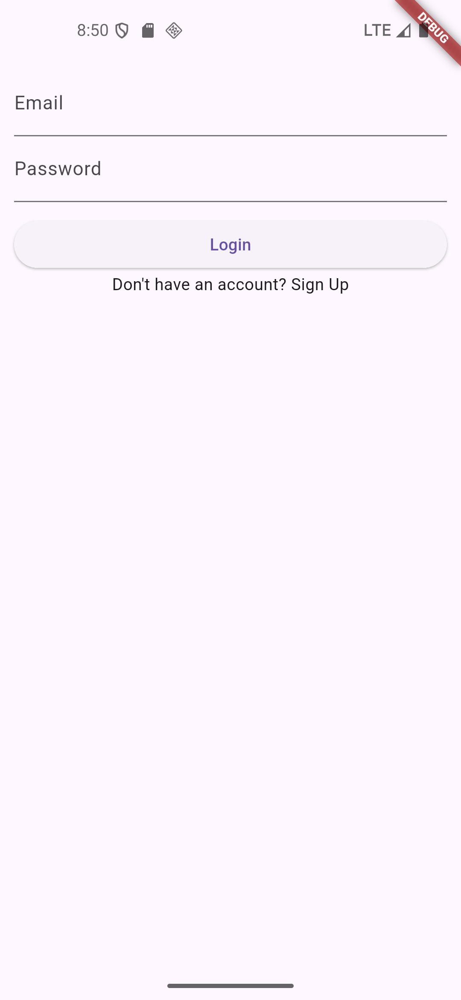
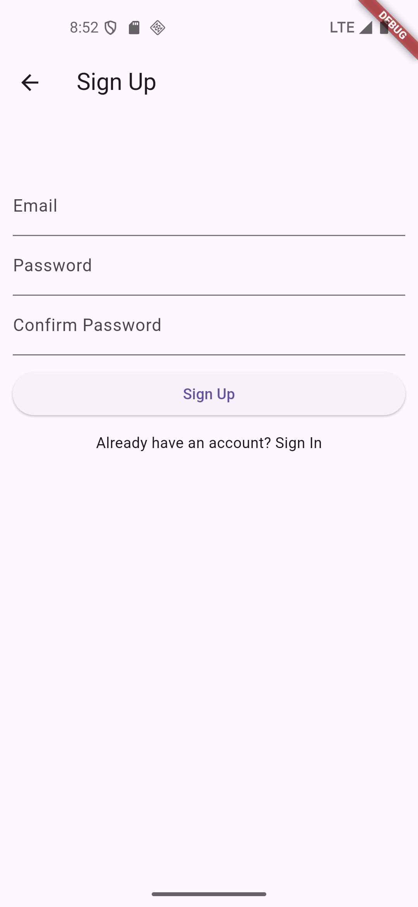
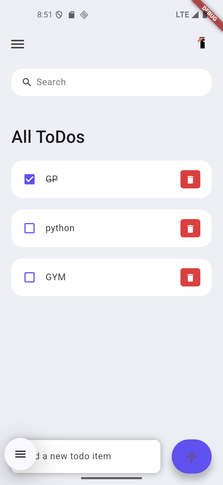
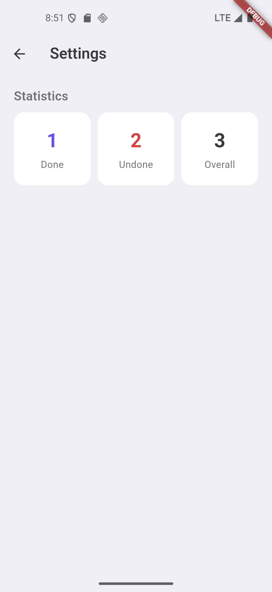

# ToDo List App

A Flutter ToDo List application with Supabase for authentication and data storage.

## Features

- User authentication (Sign Up / Login / Logout)
- Add, delete, and mark todos as done/undone
- Search todos
- Statistics (Done, Undone, Overall)
- Profile page with user info

## Screens

1. Login
2. Sign Up
3. Home (Todo List)
4. Profile
5. Settings (Statistics)

## Screenshots

| Login | Sign Up | Home |
|-------|---------|------|
|  |  |  |

| Profile | Settings |
|---------|----------|
|  |  |

## Tech Stack

- Flutter & Dart
- Supabase (Auth + Database)

